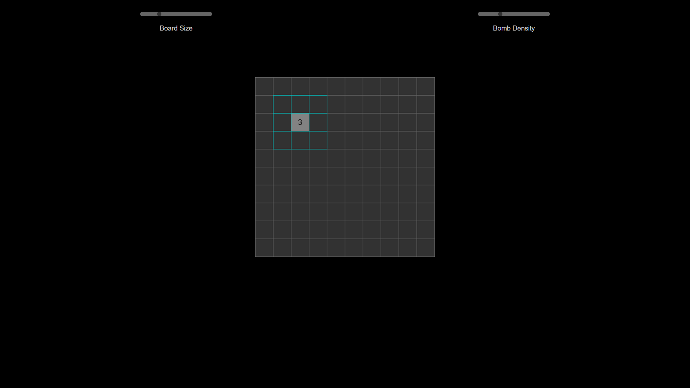

# MineSweeper
A clone of the popular game Minesweeper with adjustable board size and mine density made using p5js.

<br>

## Getting Started
* Clone this repository
* ```cd MineSweeper```
* Run ```index.html```

<br>

## How to Use
* Run ```index.html```
* Change the board size and bomb density if required
* Left click on a tile to reveal it
* Right click on a tile to flag it
* Hover over a tile to highlight its neighbours
* Press R to start a new game while preserving the board size and bomb density

<br>

## Demo




